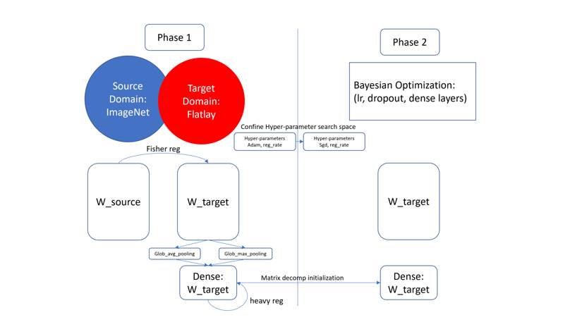

# HyperTuner: Automated Hyperparameter Tuning for Deep Neural Network

HyperTuner is an automated integrated hyperparameter tuner for finetuning classification neural networks.

Currently HyperTuner supports frameworks found in [load_base_model.py](src/load_base_model.py):
- xception
- vgg16
- resnet18, resnet50, resnet34
- mobilenet
- inceptionv3, inceptionresnetv2
- densenet121, densenet169
- nasnetlarge, nasnetmobile
- EfficientNetB0-B4

## Usage
### Requirement
Python 3.5+ is recommended for the repo. Before setting up the dependencies, we highly encourage using a 
virtual environment, because sometimes there are version conflicts problems.

- ```pip3 install -r requirement```
- Dataset layout: `(folder: dataset_name) -> (folder: label_name) -> (image:image_name)`

### Configuration
- Before training, pre-define search space in [config.py](config.py).
```
class Config:
    def __init__(self):
        # bayesian optimization space
        self.pbounds = {
            "dropout": (0.25, 0.5),
            "log_lr": (-8, -3),
            "neuronShrink": (0.01, 0.5)}

        # bayesian optimization settings
        self.bayes_init_points = 5
        self.bayes_num_iter = 25

        self.max_epoch = 15
        self.batch_size = 32

        # initial regularizer
        self.conv_reg_l2 = 1e-5
        self.dense_reg_l1 = 1e-5

        # initial log_lr for grid search
        self.log_lr_grid = [-2.5, -3, -3.0, -3.5]

        # model queue capacity
        self.queue_size = 1

        # early stopping patience
        self.patience = 1
```

### Example
Train on dataset bag pattern
- gpu: 0,1,2,3
- with 0.15 of the training set as validation set
- model preserved in `./models/[training start time]`
- backbone model: EfficientNetB2
- image size: (260, 260)

```python3 main.py -gpu 0,1,2,3 -dataset xxx/bag_pattern -backbone EfficientNetB2 -img_shape 260 -op ./models```


Train results:
- Label reflection: `./models/[training start time]/reflection.csv records 'label->encoded' reflection`

| label | encoded |
| ------ | ------- |
| geometric | 0 |
| tribal | 1 |
| zebra | 2 |
| plaid | 3 |

- `./models/[training start time]/`
- `./models/[training start time]_log/`


### HyperTune your own model
Go to [load_base_model.py](./src/load_base_model.py), change the content as follow

```
if model_name == [Your model name]:
    from [Your library] import [model class name] as base
```

Then, change the name of backbone 
```
python3 main.py -backbone [Your model name] -dataset
```



## Method
#### Transfer Learning Techniques
- Generalizing Pooling Functions in Convolutional Neural Networks: Mixed, Gated, and Tree: \
pooling = a MaxPooling + (1-a) Avgpooling at the last layer.
- Explicit Inductive Bias for Transfer Learning with Convolutional Networks:\
L2-SP-Fisher regularizer = a |W|^2 + b |W-W0|^2, where W is the CNN weights, W0 is the pre-trained weights.
- Improving Generalization Performance by Switching from Adam to SGD: \
lr_sgd = lr_adam / (1-beta2 ^ k), where beta2 is 0.9 as default, k is the epoch number.

#### AutoML on Bayesian Optimization
- Bayesian Optimization with Robust Bayesian Neural Networks:\
Explores the best hyper-parameter set in the given space.
- Cyclical Learning Rates for Training Neural Networks:\
Cyclical Learning rates with learning rate decay